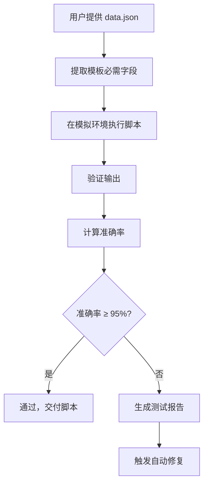
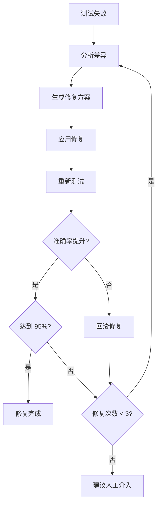

# LabsCare Script Skill 升级指南 - 测试与自动修复功能

## 升级概述

本次升级为 `labscare-script` skill 添加了**脚本测试**和**自动修复**功能，使 LLM 能够：

1. 使用用户提供的 `data.json` 作为测试数据源
2. 基于模板占位符验证脚本输出的准确率
3. 自动检测并修复常见的脚本错误
4. 通过迭代修复直到满足用户要求（准确率 ≥95%）

## 新增文件结构

```
skills/labscare-script/
├── references/
│   ├── testing-guide.md          [新增] 脚本测试指南
│   └── auto-fix-rules.md         [新增] 自动修复规则
├── scripts/
│   ├── test-script.js             [新增] 脚本测试工具
│   ├── auto-fix.js                [新增] 自动修复工具
│   └── summarize_samples.js       [原有]
├── SKILL.md                       [修改] 添加测试工作流
└── UPGRADE-GUIDE.md               [新增] 本文件
```

## 功能详解

### 1. 脚本测试功能 (`testing-guide.md`)

#### 测试目标
- **字段完整性**：输出包含模板占位符所需的所有字段
- **字段正确性**：每个字段的值来源和类型正确
- **结构正确性**：返回根结构符合模板期望
- **数据完整性**：循环数组包含所有预期的数据行

#### 准确率指标

| 指标 | 权重 | 说明 |
|------|------|------|
| 字段完整率 | 30% | 实际输出字段数 / 模板要求字段数 |
| 字段准确率 | 40% | 正确字段数 / 实际输出字段数 |
| 数据行完整率 | 20% | 实际行数 / 预期行数 |
| 类型准确率 | 10% | 类型正确字段数 / 总字段数 |

**综合准确率 = 字段完整率 × 0.3 + 字段准确率 × 0.4 + 数据行完整率 × 0.2 + 类型准确率 × 0.1**

#### 测试流程



### 2. 自动修复功能 (`auto-fix-rules.md`)

#### 修复优先级

```
1. 返回根结构错误（阻塞性问题）
2. 主过滤条件错误（导致数据为空）
3. 字段类型错误（影响渲染）
4. 关键字段缺失（核心字段）
5. 次要字段缺失（可选字段）
```

#### 支持的自动修复类型

| 问题类型 | 修复策略 | 示例 |
|----------|----------|------|
| 页头字段缺失 | 从 form/formJs 补充 | `t_wtName`, `t_htName` |
| 样品字段缺失 | 从 sample 补充 | `caseName`, `sampleId` |
| 检测项字段缺失 | 从 gauging 补充 | `factorName`, `methodName` |
| 签名字段缺失/错误 | 保留数组结构 | `t_TestMan[]` |
| 关联对象字段缺失 | 深入关联对象取值 | `t_glQX.fkCases[0].t_qx` |
| 数组被扁平化 | 恢复数组结构 | `t_TestMan[0].val` → `t_TestMan` |
| 对象被过度简化 | 恢复完整对象 | `t_clff.val` → `t_clff` |
| 数据行缺失 | 检查/放宽过滤条件 | 检查 tempId, gaugingTemplateName |

#### 修复循环



### 3. 测试工具 (`scripts/test-script.js`)

#### 主要功能

```javascript
class ScriptTester {
  constructor(testData, requiredFields, options)

  // 测试脚本
  test(script)

  // 内部方法
  - createMockEnvironment()     // 创建模拟环境
  - executeScript(script, env)  // 执行脚本
  - validateOutput(output)      // 验证输出
  - calculateAccuracy(validation) // 计算准确率
  - generateReport(...)         // 生成测试报告
}
```

#### 使用示例

```javascript
const tester = new ScriptTester(testData, requiredFields, {
  targetAccuracy: 0.95
});

const result = tester.test(scriptContent);

if (result.success) {
  console.log(`准确率: ${(result.accuracy.overall * 100).toFixed(0)}%`);
  console.log(result.report);
}
```

### 4. 自动修复工具 (`scripts/auto-fix.js`)

#### 主要功能

```javascript
class ScriptAutoFixer {
  constructor(testData, requiredFields, options)

  // 自动修复脚本
  async fix(script)

  // 内部方法
  - generateFixes(testResult, script)    // 生成修复方案
  - applyFixes(script, fixes)            // 应用修复
  - prioritizeFixes(fixes)               // 优先级排序
  - addFormField(script, fix)            // 添加表单字段
  - preserveArrayStructure(script, fix)  // 保留数组结构
  - addSampleField(script, fix)          // 添加样品字段
  - addGaugingField(script, fix)         // 添加检测项字段
  - addRelationField(script, fix)        // 添加关联字段
  - restoreArrayStructure(script, fix)   // 恢复数组结构
  - restoreObjectStructure(script, fix)  // 恢复对象结构
}
```

#### 使用示例

```javascript
const fixer = new ScriptAutoFixer(testData, requiredFields, {
  targetAccuracy: 0.95,
  maxFixAttempts: 3
});

const result = await fixer.fix(scriptContent);

if (result.success) {
  console.log('修复成功!');
  console.log(`最终准确率: ${(result.accuracy * 100).toFixed(0)}%`);
  console.log(`修复次数: ${result.attempts}`);
}
```

## 集成到 Skill 工作流

### 何时启用测试

- ✅ 用户提供了完整的 `data.json` 文件
- ✅ 用户明确要求测试脚本
- ✅ 脚本生成完成后（首次生成）
- ✅ 脚本修复完成后

### 何时跳过测试

- ❌ 用户没有提供 `data.json`
- ❌ 用户明确表示不需要测试
- ❌ 任务是"修改现有脚本"且不涉及结构变化

### LLM 使用方式

当 LLM 使用此 skill 时，应遵循以下流程：

1. **生成脚本**：按照现有工作流生成初始脚本
2. **检查测试条件**：用户是否提供了 data.json？
3. **执行测试**：如果有 data.json，运行测试
4. **查看报告**：分析测试报告中的缺失字段和错误
5. **自动修复**：如果未通过，应用自动修复
6. **迭代优化**：重复测试和修复，直到通过或达到最大次数
7. **交付结果**：提供最终脚本和测试报告

## 测试报告示例

```markdown
# 脚本测试报告

## 测试概要
- 测试时间：2026-04-03 14:30:00
- 测试数据：6 条样品
- 返回类型：array

## 准确率指标
- 字段完整率：85% (17/20 字段)
- 字段准确率：89% (17/19 字段)
- 数据行完整率：100% (6/6 行)
- 类型准确率：95% (18/19 字段)
- **综合准确率：91%**

## 测试结果
❌ 未通过 (目标准确率：≥95%)

## 缺失字段 (3)
1. `t_shuMan` - 签名字段
2. `t_qx` - 关联曲线数组
3. `t_dw` - 单位字段

## 修复建议
1. `t_shuMan` - 签名字段，需要保留数组结构，不要取 [0].val
2. `t_qx` - 关联曲线字段，需要从 `t_glQX.fkCases[0].t_qx` 取值
3. `t_dw` - 单位字段，需要从 `t_qx.caseList[0].t_JZtab[0].t_dw` 取值
```

## 修复历史示例

```javascript
[
  {
    attempt: 1,
    status: 'applied',
    message: '应用了 3 个修复',
    beforeAccuracy: 0.85,
    afterAccuracy: 0.92,
    timestamp: '2026-04-03T10:30:00.000Z'
  },
  {
    attempt: 2,
    status: 'applied',
    message: '应用了 1 个修复',
    beforeAccuracy: 0.92,
    afterAccuracy: 0.96,
    timestamp: '2026-04-03T10:30:15.000Z'
  }
]
```

## 需要人工介入的情况

以下情况应停止自动修复并建议人工介入：

- 连续 3 次修复未达到目标准确率
- 模板理解错误，需要重新分析模板结构
- 业务逻辑复杂，涉及特殊的条件判断
- 测试数据与真实数据结构差异较大
- 修复导致准确率持续下降

## 模拟环境要求

测试工具需要模拟以下 LabsCare API 和函数：

```javascript
// 需要模拟的 API
{
  load: (path) => {},
  get: (name) => helper,
  set: (name, value) => {},
  getProjectData: (projectId) => formJs,
  getProjectSamples: (projectId) => samplesJs,
  getForm: (procedures) => form,
  getCheckBox: (checked) => '☑' | '☐',
  formatDateCN: (date) => '2026年4月3日',
  getSignUrl: (sign) => '/user/xxx/sign.png',
  headerUrl: '/user/',
  procedures: {...},
  projectId: 'test-project-id'
}
```

## 常见问题

### Q: 测试通过但实际运行失败？

**A**: 可能原因：
- 测试数据与真实数据结构不完全一致
- 模拟 API 与真实 API 行为差异
- 环境变量或全局对象缺失

### Q: 测试报告显示字段完整但实际缺少？

**A**: 检查：
- 字段名称拼写（大小写、下划线）
- 字段嵌套层级是否正确
- 返回根结构是否正确

### Q: 自动修复失败怎么办？

**A**:
1. 查看修复历史了解失败原因
2. 检查测试数据是否完整
3. 考虑是否需要人工介入
4. 提供更多占位符说明或示例

## 维护建议

1. **扩展修复规则**：根据实际使用情况，在 `auto-fix-rules.md` 中添加更多修复模式
2. **优化测试环境**：根据真实 API 行为，改进模拟环境的准确性
3. **收集修复模式**：记录常见的修复模式，用于改进自动修复算法
4. **更新文档**：定期更新测试指南和规则文档，反映新的发现

## 向后兼容性

本次升级**完全向后兼容**：

- 没有提供 `data.json` 时，skill 工作流与之前完全一致
- 所有原有功能保持不变
- 新增功能仅在用户明确提供测试数据时启用

## 下一步计划

可能的未来改进：

1. 支持 TypeScript 脚本测试
2. 添加性能测试（大数据量场景）
3. 支持多模板并行测试
4. 添加脚本相似度检测，避免重复修复
5. 集成到 CI/CD 流程
6. 提供可视化测试报告
